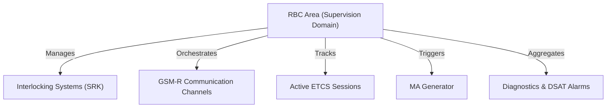
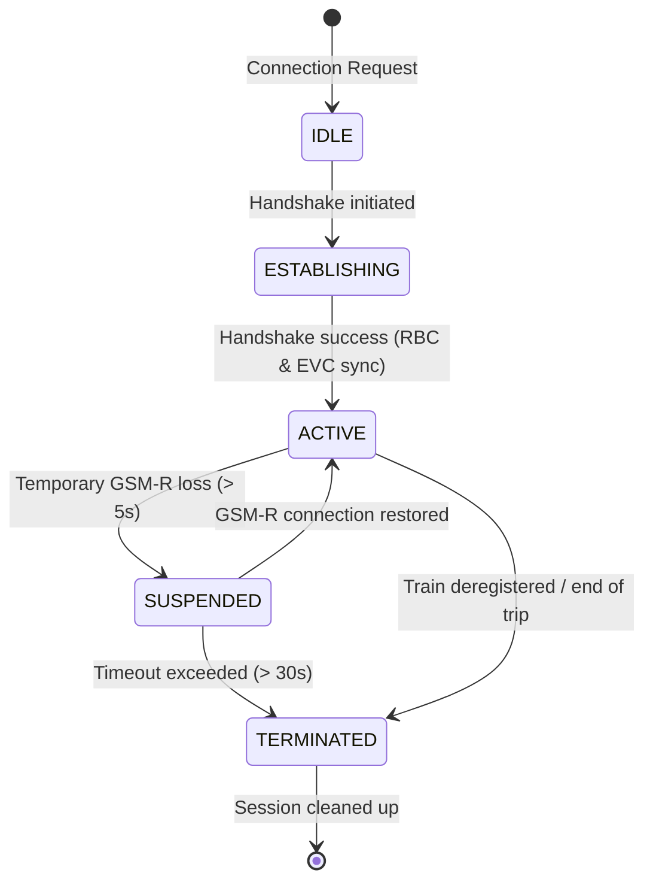
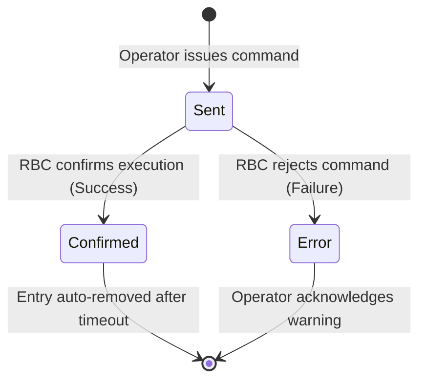

# ETCS/RBC Supervisory System Specification

**Document:** 18  
**Status:** Implemented  
**Relates to:** [03-initial-architecture.md](03-initial-architecture.md), [09-communication-contract.md](09-communication-contract.md), [14-interlocking-model.md](14-interlocking-model.md), [17-control-system-interface.md](17-control-system-interface.md)

---

## Overview

The **ETCS/RBC Supervisory System** is a centralized supervisory layer intended for operational control and monitoring of Radio Block Centre (`RBC`) areas operating within ERTMS/ETCS infrastructure.

### Key Responsibilities

The system is responsible for the following core operations:
* **Area Supervision:** Monitoring and control of RBC operational areas.
* **Session Management:** Overseeing active ETCS sessions with onboard equipment.
* **Movement Authorities:** Supervising Movement Authority (`MA`) generation and transmission.
* **Interlocking Integration:** Managing interfaces with interlocking (SRK) systems.
* **Train Positioning:** Tracking and supervising real-time train positions.
* **Safety & Operations:** Handling alarms, executing operational RBC commands, sending text messages to trains, and managing operator authorization.
* **Diagnostics:** Presenting DSAT (detector of railway vehicle defects) alarms and system diagnostic events.

### Cooperating Systems

The supervisory layer actively cooperates with:
* **RBC systems** (Radio Block Centres)
* **Interlocking systems** (SRK)
* **GSM-R infrastructure** (communication)
* **TMS systems** (Traffic Management Systems)
* **Operator workstations** (HMI/MMI)
* **Diagnostic systems**

> [!IMPORTANT]
> Control of operational objects requires first obtaining control authority over the selected RBC area.

---

## Object Naming & Identification Schema

To ensure consistency and safety, objects within the ETCS/RBC supervisory layer follow standardized operational naming conventions and unique identifier structures.

### 1. Object Naming Conventions

Operational identifiers (`pID`) follow standard naming prefixes depending on the object type:

| Object | Naming Prefix | Example |
| :--- | :--- | :--- |
| **RBC Instance** | `rbc_<ID>` | `rbc_central` |
| **RBC Area** | `area_<ID>` | `area_X` |
| **ETCS Session** | `ses_<ID>` | `ses_089` |
| **Movement Authority** | `ma_<ID>` | `ma_1044` |
| **Balise Group** | `bg_<ID>` | `bg_1002` |
| **LEU** | `leu_<ID>` | `leu_201` |
| **Communication Channel** | `com_<ID>` | `com_gsmr_1` |
| **Operator Workstation** | `ops_<ID>` | `ops_workstation_1` |
| **System Alarm** | `alm_<ID>` | `alm_temp_high` |
| **Text Message** | `msg_<ID>` | `msg_text_01` |

---

### 2. UID Structure

Each system object is assigned a structured Unique Identifier (UID) that consists of four main parts:

```text
gID = [TYPE]-[AREA]-[pID]-[UUID]
```

* **`gID` (Global Identifier):** The fully qualified unique string representing the object across the entire system.
* **`pID` (Operational Identifier):** The type-prefixed identifier as defined in the Object Naming Conventions table.
* **`sID` (RBC Area Identifier):** The identifier representing the containing RBC area.
* **`type` (Object Type):** The classification of the object (e.g., `RBC`, `SESSION`, `MA`).

#### UID Field breakdown

| Field | Description | Example |
| :--- | :--- | :--- |
| **`TYPE`** | Object class / type | `RBC` |
| **`AREA`** | Supervision area name | `WARSAW` |
| **`pID`** | Operational identifier | `rbc_central` |
| **`UUID`** | Globally unique sequential ID (padded counter) | `0000001` |

**Full `gID` Example:**  
`RBC-WARSAW-rbc_central-0000001`

---

### 3. ID Generation

The system uses a standardized sequential generator function to construct `gID` strings dynamically:

```cpp
#include <string>

std::string generateGID(const std::string& type, const std::string& area, const std::string& pID)
{
    // padLeft format pads globalCounter to a 7-digit width
    std::string idNumber = padLeft(std::to_string(globalCounter), 7, '0');

    std::string gID = type + "-" +
                      area + "-" +
                      pID  + "-" +
                      idNumber;

    globalCounter++;
    return gID;
}
```

---

## RBC Topology Model

### RBC Operational Area

An RBC area represents a logical supervision domain. It is responsible for the overall orchestration of track sections, safety boundaries, and train communication:



#### Area Scope & Contents
* Controlled track sections and interlocking devices.
* Active ETCS sessions.
* Physical trackside hardware (Balise groups, LEUs).
* GSM-R communication endpoints.
* Diagnostic and maintenance interfaces.

---

## ETCS Session Model

An **ETCS Session** represents an active communication relationship between the onboard ETCS computer (EVC) and the trackside Radio Block Centre (RBC).

### 1. Session Structure

Each session maintains the following operational state:

| Field | Type | Description |
| :--- | :--- | :--- |
| `sessionID` | `string` | Unique session identifier. |
| `trainID` | `string` | Operational train number (e.g., `IC3812`). |
| `rbcID` | `string` | The assigned RBC handling the session. |
| `status` | `enum` | Active state of the connection (see table below). |
| `position` | `object` | Last reported physical position (referenced to Balise Group). |
| `lastContact` | `timestamp`| Time of the last received valid packet. |
| `etcsLevel` | `enum` | Currently active ETCS Level (e.g., Level 2, Level 3). |
| `mode` | `enum` | Train operating mode (e.g., FS, SR, OS, SH). |

---

### 2. Session State Machine



#### State Definitions

| State | Meaning | Description |
| :--- | :--- | :--- |
| **`IDLE`** | Inactive session | The session is registered in the database but no active connection exists. |
| **`ESTABLISHING`**| Connection establishment | Connection handshake is ongoing. |
| **`ACTIVE`** | Active session | Bi-directional communication is fully active; train is supervised. |
| **`SUSPENDED`** | Temporary communication loss | GSM-R link is down, waiting for recovery. |
| **`TERMINATED`** | Terminated session | Session is closed and resources are scheduled for cleanup. |

---

## Movement Authority (MA) Model

The **Movement Authority (MA)** defines the distance and speed limits authorized by the RBC for a supervised train.

### MA Data Structure

An MA payload is represented as a structured JSON object:

```json
{
  "maID": "MA-WAR-000045",
  "trainID": "IC3812",
  "startLocation": "BG-1002",
  "endLocation": "BG-1044",
  "maxSpeedKmh": 160,
  "validUntil": "2026-05-21T15:22:00Z"
}
```

---

## RBC Operational Commands

Operators issue commands to control the state and behavior of the RBC supervisory layer.

### 1. Available Commands

| Command | Name | Description |
| :---: | :--- | :--- |
| **`REF`** | Refresh | Refresh RBC data from the interlocking systems. |
| **`PGA`** | Takeover Authority | Take over standard operator authorization for the selected area. |
| **`EGA`** | Emergency Takeover | Emergency override to seize control authority. |
| **`CS`** | Consistency Check | Perform a cross-system consistency check (RBC vs. Interlocking). |
| **`DIS`** | Disconnect/Restart | Disconnect and restart communication channels for the selected RBC. |
| **`PAR`** | Passive Mode | Force the RBC instance into passive/standby mode. |

---

### 2. Command Execution Lifecycle



#### Command Confirmation (Success)
1. RBC processes the command and returns a success payload.
2. The command state on the HMI changes to **`Confirmed`**.
3. After a configured timeout, the command entry is automatically cleaned up and removed from the active log.

#### Command Rejection (Failure)
1. RBC rejects the command or the communication times out.
2. The command state changes to **`Error`**.
3. A visual alert is raised. The operator must verify RBC status and interlocking connectivity before attempting further operations.

---

## Train Operations

### 1. Train Positioning

The positioning function allows the operator to set or override the approximate location of a train within an RBC operational area.

#### Positioning Steps
1. The operator selects the **Positioning** tool.
2. The HMI dims the overall station view.
3. The signals and balise groups that permit positioning are highlighted.
4. The operator selects the physical trackside object corresponding to the approximate train position.
5. The operator issues the **Set Position** command.
6. The command is transmitted to the RBC as a **two-stage transaction** to prevent accidental inputs.

#### Positioning Checklist
> [!IMPORTANT]
> Positioning can only be executed if all of the following conditions are met:
> - [ ] The operator holds active control authority for the area.
> - [ ] An active ETCS session exists with the target train.
> - [ ] Reliable communication with the RBC is established.
> - [ ] The selected trackside signal belongs directly to the supervised area.

---

### 2. Train Deregistration

The **Deregistration** command forcibly removes a train from the active trackside RBC system.

> [!WARNING]
> This is a safety-critical operation. Forcing deregistration will instantly terminate the ETCS session, clear RBC tracking data, and block any further Movement Authority (MA) generation.

#### Typical Use Cases
* Permanent GSM-R communication loss.
* Critical onboard ETCS equipment failure.
* Abnormal ETCS session loss without proper handshake termination.
* Manual recovery from system desynchronization.

---

### 3. Emergency Train Stop

The system supports a safety-critical **Train Stop** command.

#### Execution Process
1. The operator issues the emergency stop.
2. The RBC transmits an immediate **emergency stop profile / stop request** to the train.
3. The current Movement Authority (MA) is instantly shortened to the train's current position.
4. The train enters supervised emergency braking mode.

> [!IMPORTANT]
> The Emergency Stop command can only be executed for trains with an active, established ETCS session.

#### Stop Cancellation
A previously issued stop request can be cancelled using the **Cancel Stop** command. This is only possible if:
* The RBC still maintains active supervision over the train.
* The ETCS session is healthy and active.
* No emergency limits or final safety-trip states have been reached.

---

## Text Messages (TMS)

Operators can send alphanumeric text messages to be displayed on the train's Driver-Machine Interface (DMI).

### 1. Formatting Constraints
* **Length:** Up to 255 characters.
* **Encoding:** Standard ETCS text format.
* **Restrictions:** National diacritical characters (e.g. Polish letters like `ą, ć, ę, ł, ń, ó, ś, ź, ż`) are strictly forbidden.

### 2. Allowed Character Set

| Category | Range |
| :--- | :--- |
| **Letters** | `A-Z`, `a-z` |
| **Digits** | `0-9` |
| **Special Characters**| `. , : ; ? ! - /` (including space) |

---

### 3. Message Status Log

Messages dispatched to trains go through the following statuses:

| Status | Meaning | Description |
| :---: | :--- | :--- |
| **`SENT`** | Message Sent | The message has been sent to the GSM-R gateway. |
| **`DELIVERED`** | Message Delivered | The train EVC confirmed receipt and displayed the message. |
| **`FAILED`** | Transmission Failure | The GSM-R gateway rejected the packet or transmission failed. |
| **`TIMEOUT`** | Confirmation Timeout | No receipt confirmation was received within the maximum timeout window. |

---

## Alarms & Diagnostics

The supervisory system aggregates diagnostic logs and alarm alerts from multiple distributed components:
* Central RBC systems
* Interlocking (SRK) systems
* GSM-R infrastructure
* DSAT (Defektoskopia Sygnalizacji i Aparatury Torowej) trackside sensors
* Onboard ETCS equipment (via active sessions)

### Severity Model

Alarms are classified into four severity levels:

| Severity | Color | Meaning |
| :---: | :---: | :--- |
| **`INFO`** | Blue | System information and non-critical status updates. |
| **`WARNING`** | Yellow | Operational warnings (e.g., communication degradation, non-critical faults). |
| **`CRITICAL`** | Orange | Safety-related conditions (e.g., interlocking route conflicts, sensor faults). |
| **`EMERGENCY`**| Red | Immediate operator intervention required (e.g., unauthorized train movement). |

---

## Communication Supervision

The system runs a low-latency heartbeat check to continuously monitor all interfaces.

### Supervision Scope
* GSM-R link status.
* RBC heartbeat signals.
* Interlocking system links.
* ETCS session keep-alive timers.
* Raw transmission packet error rates.

### Interface Timeouts

If an interface fails to respond within the designated window, the system automatically triggers a connection-loss alert:

| Interface Event | Timeout | Action Taken |
| :--- | :---: | :--- |
| **Interlocking Link Loss** | `3 s` | Raise CRITICAL alarm, lock route adjustments. |
| **RBC Heartbeat Loss** | `5 s` | Raise EMERGENCY alarm, transition active sessions to SUSPENDED. |
| **ETCS Session Timeout** | `30 s` | Terminate session, retract active Movement Authorities. |

---

## Operator Authorization Model

To prevent unauthorized or conflicting commands, critical actions require the operator to hold **Control Authority** over the specific RBC operational area.

### Actions Requiring Active Authority
* **Movement Authority (MA) Cancellation**
* **Emergency Train Stop** and **Stop Cancellation**
* **Train Deregistration**
* **Manual Train Positioning**
* **Maintenance/Test Mode Activation**
* **RBC Area Takeover** (`PGA` and `EGA` commands)
