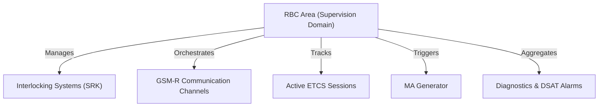
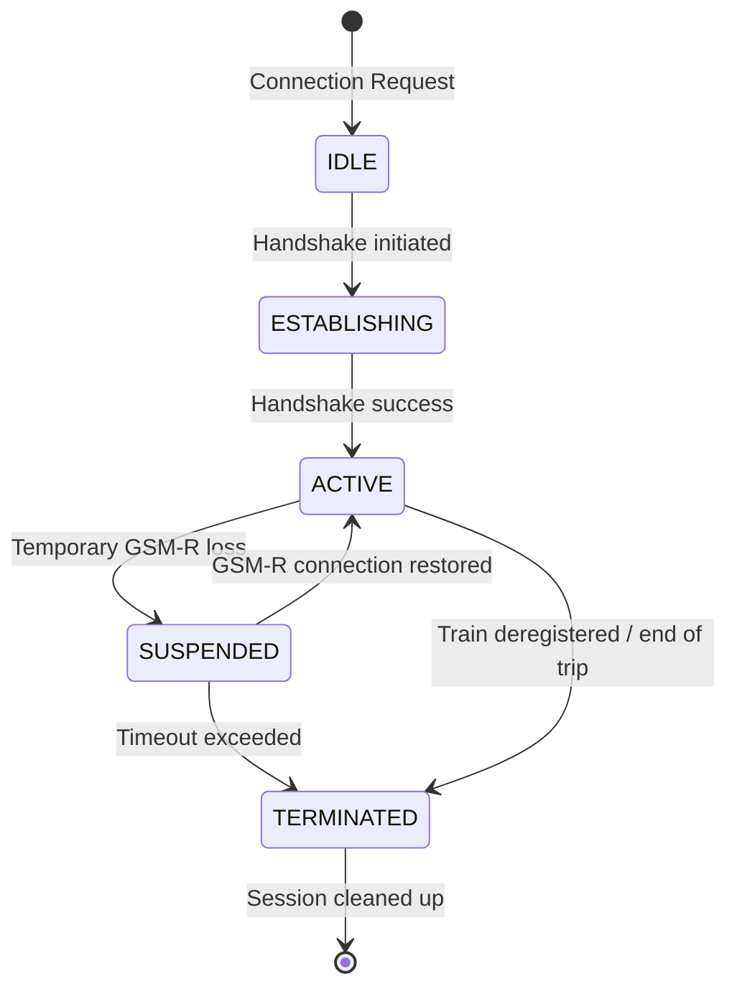
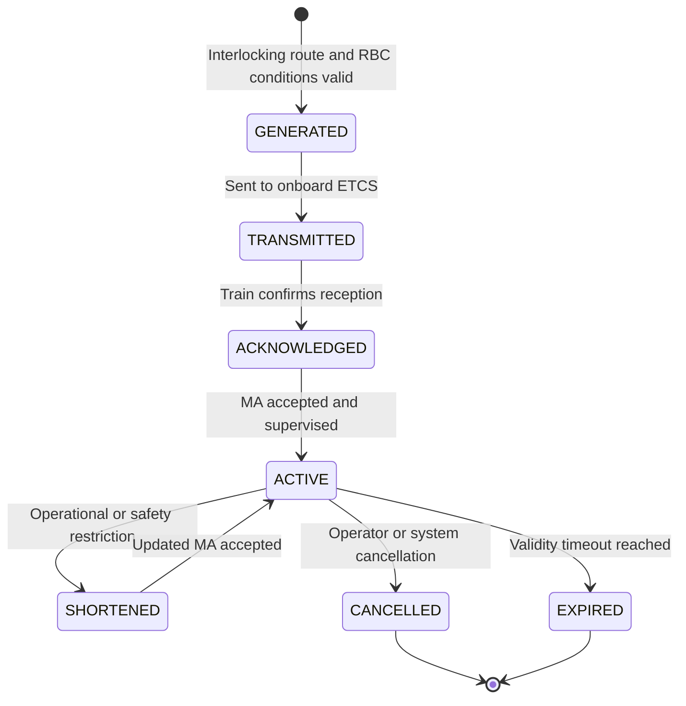
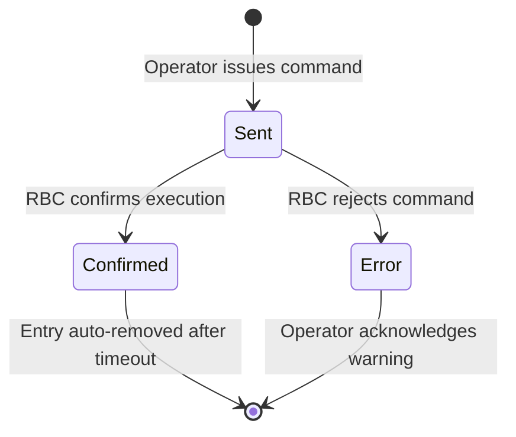
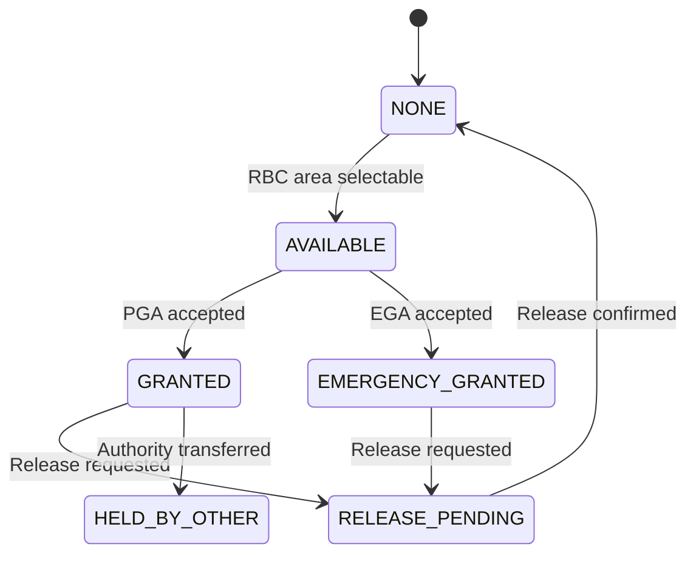
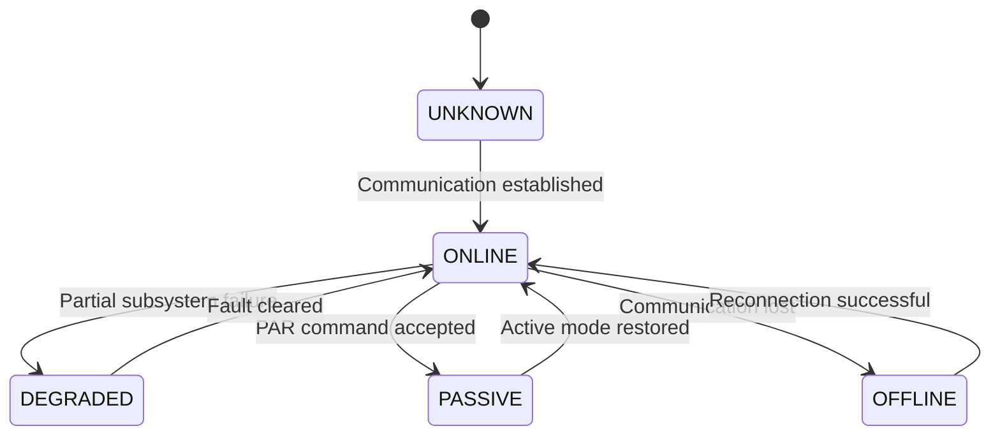

# ETCS/RBC Supervisory System Specification

**Document:** 18  
**Status:** Implemented  
---

## Overview

The **ETCS/RBC Supervisory System** is a centralized supervisory layer intended for operational control and monitoring of Radio Block Centre (`RBC`) areas operating within ERTMS/ETCS infrastructure.

The system provides operator-facing supervision of RBC-controlled train movements, ETCS sessions, train position reports, Movement Authorities, alarms, diagnostic information, and safety-related commands.

### Key Responsibilities

The system is responsible for the following core operations:

- **Area Supervision:** monitoring and control of RBC operational areas.
- **Session Management:** overseeing active ETCS sessions with onboard equipment.
- **Movement Authorities:** supervising Movement Authority (`MA`) generation, transmission, shortening, cancellation, and end-of-authority information.
- **Interlocking Integration:** managing interfaces with interlocking (`SRK`) systems.
- **Train Positioning:** tracking and supervising real-time and manually assigned train positions.
- **Safety & Operations:** handling alarms, executing operational RBC commands, sending text messages to trains, and managing operator authorization.
- **Diagnostics:** presenting DSAT alarms, RBC diagnostic events, communication states, and system status information.
- **Visualization:** presenting train labels, ETCS mode symbols, RBC connection states, LCS linkage, TSR states, and operational train lists on the HMI.

### Cooperating Systems

The supervisory layer actively cooperates with:

- **RBC systems** — Radio Block Centres,
- **Interlocking systems** — SRK,
- **GSM-R infrastructure** — radio communication with onboard ETCS,
- **TMS systems** — Traffic Management Systems,
- **Operator workstations** — HMI/MMI,
- **Diagnostic systems** — including DSAT and RBC technical diagnostics.

> [!IMPORTANT]
> Control of operational objects requires first obtaining control authority over the selected RBC area.  
> Without active authorization, safety-related commands remain unavailable or are rejected by the system.

---

## Graphical Interface Model

The ETCS/RBC supervisory interface consists of a set of operator windows and panels used for train supervision, RBC diagnostics, command handling, and alarm/event presentation.

### Main Interface Elements

The HMI contains the following main elements:

- station and line visualization view,
- RBC / LCS connection status indicators,
- train visualization and train labels,
- active train list,
- train management window,
- TSR visualization and management area,
- alarm window,
- event window,
- DSAT alarm window,
- RBC authorization panel,
- RBC command panel.

### Station View

The station view presents the railway layout and objects supervised by the RBC and interlocking systems.

The view may include:

- track sections,
- switches,
- signals,
- train symbols,
- train labels,
- TSR indicators,
- RBC connection indicators,
- LCS linking indicators,
- diagnostic status symbols.

The station view is used both for passive observation and for selecting objects during operator procedures such as train positioning, TSR handling, or command execution.

### RBC / LCS Linking

The interface indicates whether the station view is connected to a defined RBC and whether the RBC is linked with the proper LCS.

| State | Meaning |
|---|---|
| `LINKED` | RBC and LCS are connected and data exchange is active. |
| `UNLINKED` | RBC or LCS is not connected to the current visualization context. |
| `DEGRADED` | Communication exists, but not all data are consistent or available. |
| `UNKNOWN` | State cannot be determined from current data. |

---

## Object Naming & Identification Schema

To ensure consistency and safety, objects within the ETCS/RBC supervisory layer follow standardized operational naming conventions and unique identifier structures.

### Object Naming Conventions

Operational identifiers (`pID`) follow standard naming prefixes depending on the object type.

| Object | Naming Prefix | Example |
|---|---|---|
| **RBC Instance** | `rbc_<ID>` | `rbc_central` |
| **RBC Area** | `area_<ID>` | `area_X` |
| **ETCS Session** | `ses_<ID>` | `ses_089` |
| **Movement Authority** | `ma_<ID>` | `ma_1044` |
| **Balise Group** | `bg_<ID>` | `bg_1002` |
| **LEU** | `leu_<ID>` | `leu_201` |
| **Communication Channel** | `com_<ID>` | `com_gsmr_1` |
| **Operator Workstation** | `ops_<ID>` | `ops_workstation_1` |
| **System Alarm** | `alm_<ID>` | `alm_temp_high` |
| **Text Message** | `msg_<ID>` | `msg_text_01` |
| **TSR Object** | `tsr_<ID>` | `tsr_001` |
| **Train Label** | `label_<ID>` | `label_123456` |

---

## UID Structure

Each system object is assigned a structured Unique Identifier (`UID`) that consists of four main parts:

```text
gID = [TYPE]-[AREA]-[pID]-[UUID]
```

| Field | Description | Example |
|---|---|---|
| `TYPE` | object class / type | `RBC` |
| `AREA` | supervision area name | `WARSAW` |
| `pID` | operational identifier | `rbc_central` |
| `UUID` | globally unique sequential ID | `0000001` |

Full `gID` example:

```text
RBC-WARSAW-rbc_central-0000001
```

### ID Generation

```cpp
#include <string>

std::string generateGID(const std::string& type, const std::string& area, const std::string& pID)
{
    std::string idNumber = padLeft(std::to_string(globalCounter), 7, '0');

    std::string gID = type + "-" +
                      area + "-" +
                      pID  + "-" +
                      idNumber;

    globalCounter++;
    return gID;
}
```

---

## RBC Topology Model

### RBC Operational Area

An RBC area represents a logical supervision domain. It is responsible for the overall orchestration of track sections, safety boundaries, train communication, and movement authority generation.



### Area Scope & Contents

The operational area may contain:

- controlled track sections,
- interlocking devices,
- active ETCS sessions,
- train labels and position references,
- balise groups,
- LEU devices,
- GSM-R communication endpoints,
- diagnostic interfaces,
- DSAT interfaces,
- TSR objects,
- RBC and LCS linking data.

---

## ETCS Session Model

An **ETCS Session** represents an active communication relationship between the onboard ETCS computer (`EVC`) and the trackside Radio Block Centre (`RBC`).

### Session Structure

| Field | Type | Description |
|---|---|---|
| `sessionID` | `string` | Unique session identifier. |
| `trainID` | `string` | Operational train number. |
| `nidEngine` | `string` | ETCS onboard engine identifier. |
| `rbcID` | `string` | Assigned RBC handling the session. |
| `status` | `enum` | Active state of the connection. |
| `position` | `object` | Last reported physical position, usually referenced to a balise group. |
| `lastContact` | `timestamp` | Time of the last received valid packet. |
| `etcsLevel` | `enum` | Currently active ETCS level. |
| `mode` | `enum` | Train operating mode, such as FS, SR, OS, SH, NL. |
| `maEnd` | `object` | End of current Movement Authority. |
| `speedKmh` | `number` | Current train speed. |
| `precedingSignal` | `string` | Signal preceding or related to current train position. |
| `authorizationState` | `enum` | State of operator authorization for commands on this train. |

### Session State Machine



### State Definitions

| State | Meaning | Description |
|---|---|---|
| `IDLE` | Inactive session | The session is registered but no active connection exists. |
| `ESTABLISHING` | Connection establishment | Connection handshake is ongoing. |
| `ACTIVE` | Active session | Bi-directional communication is active; train is supervised. |
| `SUSPENDED` | Temporary communication loss | GSM-R link is down, waiting for recovery. |
| `TERMINATED` | Terminated session | Session is closed and resources are scheduled for cleanup. |

---

## Train List Model

The HMI provides a train list containing all trains currently known to the RBC supervisory system.

### Train List Fields

| Field | Description |
|---|---|
| `trainNumber` | Operational train number entered or received from external systems. |
| `nidEngine` | ETCS onboard identifier. |
| `etcsMode` | Current ETCS operating mode. |
| `speedKmh` | Current train speed. |
| `precedingSignal` | Signal associated with the train position. |
| `maEnd` | Current end of Movement Authority. |
| `positionStatus` | Current train position status. |
| `requestStatus` | Current command/request status for the train. |

### Train Details

After selecting a train, the operator may view detailed data grouped into tabs or panels.

Typical groups include:

- dynamic train data,
- static train data,
- ETCS mode and level data,
- current authorization state,
- current Movement Authority,
- preceding signal,
- communication state,
- received and sent text messages,
- active requests and commands,
- diagnostic events.

---

## Train Visualization

### Train Symbol

Trains are visualized on the station view using a graphical train symbol with direction, color, and additional state markings.

The train symbol may indicate:

- train direction,
- train position,
- active ETCS supervision,
- communication state,
- relation to RBC supervision,
- invalid or uncertain position,
- current operational state.

### Train Label

Each train may be represented by a label attached to the train symbol.

The label may contain:

- train number,
- `NID_ENGINE`,
- speed,
- ETCS mode,
- route or signal relation,
- current RBC state,
- operational warning marker.

### Train Position State

| State | Meaning |
|---|---|
| `VALID` | Train position is confirmed and reliable. |
| `APPROXIMATE` | Train position is known approximately. |
| `UNKNOWN` | Train position is unknown or unavailable. |
| `INVALID` | Train position data are inconsistent or rejected. |
| `LOST` | Train has lost reliable relation with RBC supervision. |

---

## Movement Authority (MA) Model

The **Movement Authority (`MA`)** defines the distance and speed limits authorized by the RBC for a supervised train.

### MA Data Structure

```json
{
  "maID": "MA-WAR-000045",
  "trainID": "IC3812",
  "startLocation": "BG-1002",
  "endLocation": "BG-1044",
  "maxSpeedKmh": 160,
  "validUntil": "2026-05-21T15:22:00Z"
}
```

### MA Lifecycle



### MA Operational Notes

Movement Authority generation depends on:

- interlocking route status,
- signal and route locking state,
- track occupancy state,
- RBC and EVC communication state,
- train position validity,
- temporary speed restrictions,
- emergency stop state,
- operator authorization when manual intervention is required.

---

## RBC Operational Commands

Operators issue commands to control the state and behavior of the RBC supervisory layer.

### Available RBC Commands

| Command | Name | Description |
|---|---|---|
| `REF` | Refresh | Refresh RBC data from the interlocking systems. |
| `PGA` | Takeover Authority | Take over standard operator authorization for the selected area. |
| `EGA` | Emergency Takeover | Emergency override to seize control authority. |
| `CS` | Consistency Check | Perform a cross-system consistency check between RBC and interlocking. |
| `DIS` | Disconnect / Restart | Disconnect and restart communication channels for the selected RBC. |
| `PAR` | Passive Mode | Force the RBC instance into passive or standby mode. |

### Command Execution Lifecycle



### Command Confirmation

In case of successful execution:

1. RBC processes the command and returns a success payload.
2. The command state on the HMI changes to `Confirmed`.
3. After a configured timeout, the command entry is automatically removed from the active list.

### Command Rejection

In case of failure:

1. RBC rejects the command or communication times out.
2. The command state changes to `Error`.
3. A visual alert is raised.
4. The operator must verify RBC status and interlocking connectivity before attempting further operations.

---

## Operator Authorization Model

To prevent unauthorized or conflicting commands, critical actions require the operator to hold **Control Authority** over the specific RBC operational area.

### Authorization States

| State | Meaning |
|---|---|
| `NONE` | Operator has no authority for the selected RBC area. |
| `AVAILABLE` | Authority may be requested. |
| `GRANTED` | Operator currently holds authority. |
| `HELD_BY_OTHER` | Another operator workstation holds authority. |
| `EMERGENCY_GRANTED` | Authority was obtained using emergency takeover. |
| `RELEASE_PENDING` | Release of authority is in progress. |

### Actions Requiring Active Authority

The following operations require active authority:

- Movement Authority cancellation,
- Emergency Train Stop,
- Stop Cancellation,
- Train Deregistration,
- Manual Train Positioning,
- Maintenance/Test Mode Activation,
- RBC Area Takeover,
- RBC command execution,
- TSR-related operational actions where they affect RBC-supervised movement.

### Authorization Flow



---

## Train Operations

### Train Positioning

The positioning function allows the operator to set or override the approximate location of a train within an RBC operational area.

#### Positioning Steps

1. The operator selects the **Positioning** tool.
2. The HMI dims the overall station view.
3. Signals or allowed positioning objects are highlighted.
4. The operator selects the physical trackside object corresponding to the approximate train position.
5. The operator issues the **Set Position** command.
6. The command is transmitted to the RBC as a two-stage transaction to prevent accidental inputs.

#### Positioning Checklist

> [!IMPORTANT]
> Positioning can only be executed if all of the following conditions are met:
>
> - [ ] The operator holds active control authority for the area.
> - [ ] An active ETCS session exists with the target train.
> - [ ] Reliable communication with the RBC is established.
> - [ ] The selected trackside signal or positioning object belongs directly to the supervised area.

### Train Deregistration

The **Deregistration** command forcibly removes a train from the active trackside RBC system.

> [!WARNING]
> This is a safety-critical operation. Forcing deregistration terminates the ETCS session, clears RBC tracking data, and blocks further Movement Authority generation for the affected train until a new valid session is established.

Typical use cases:

- permanent GSM-R communication loss,
- critical onboard ETCS equipment failure,
- abnormal ETCS session loss without proper handshake termination,
- manual recovery from system desynchronization.

### Emergency Train Stop

The system supports a safety-critical **Train Stop** command.

Execution process:

1. The operator issues the emergency stop.
2. The RBC transmits an emergency stop profile or stop request to the train.
3. The current Movement Authority may be shortened to the train's current position.
4. The train enters supervised emergency braking mode.

> [!IMPORTANT]
> The Emergency Stop command can only be executed for trains with an active, established ETCS session.

### Stop Cancellation

A previously issued stop request can be cancelled using the **Cancel Stop** command.

Cancellation is only possible if:

- the RBC still maintains active supervision over the train,
- the ETCS session is healthy and active,
- no emergency limits or final safety-trip states have been reached.

---

## Text Messages (TMS)

Operators can send alphanumeric text messages to be displayed on the train Driver-Machine Interface (`DMI`).

### Formatting Constraints

| Parameter | Value |
|---|---|
| `length` | Up to 255 characters |
| `encoding` | Standard ETCS text format |
| `diacritics` | National diacritical characters are not allowed |

Forbidden characters include Polish letters such as:

```text
ą ć ę ł ń ó ś ź ż
```

### Allowed Character Set

| Category | Range |
|---|---|
| Letters | `A-Z`, `a-z` |
| Digits | `0-9` |
| Special characters | `. , : ; ? ! - /` including space |

### Message Status Log

Messages dispatched to trains go through the following statuses.

| Status | Meaning | Description |
|---|---|---|
| `SENT` | Message Sent | The message has been sent to the GSM-R gateway. |
| `DELIVERED` | Message Delivered | The train EVC confirmed receipt and displayed the message. |
| `FAILED` | Transmission Failure | The GSM-R gateway rejected the packet or transmission failed. |
| `TIMEOUT` | Confirmation Timeout | No receipt confirmation was received within the maximum timeout window. |

---

## TSR Visualization and Supervision

The supervisory system may present Temporary Speed Restriction (`TSR`) information when the RBC area includes TSR handling.

### TSR Data Presented on HMI

The TSR visualization may contain:

- TSR identifier,
- TSR state,
- affected track section or route,
- validity time,
- maximum permitted speed,
- RBC relation,
- confirmation state,
- source of restriction.

### TSR States

| State | Meaning |
|---|---|
| `ACTIVE` | TSR is active and must be respected by RBC-supervised movements. |
| `PENDING` | TSR is defined but not yet active or not yet confirmed. |
| `CANCELLED` | TSR has been cancelled. |
| `EXPIRED` | TSR validity period has ended. |
| `UNKNOWN` | TSR state cannot be determined from available data. |

### TSR Relation to RBC

When TSR data affect an RBC-supervised route, the system shall provide this information to the RBC logic so that Movement Authority generation and speed profiles reflect the restriction.

---

## Alarms & Diagnostics

The supervisory system aggregates diagnostic logs and alarm alerts from multiple distributed components:

- central RBC systems,
- interlocking systems,
- GSM-R infrastructure,
- DSAT trackside sensors,
- onboard ETCS equipment via active sessions,
- operator workstation modules,
- LCS and RBC communication modules.

### Severity Model

Alarms are classified into four severity levels.

| Severity | Color | Meaning |
|---|---|---|
| `INFO` | Blue | System information and non-critical status updates. |
| `WARNING` | Yellow | Operational warnings, such as communication degradation or non-critical faults. |
| `CRITICAL` | Orange | Safety-related conditions, such as route conflicts or sensor faults. |
| `EMERGENCY` | Red | Immediate operator intervention required. |

### Alarm List

The alarm list presents currently active alarms. The operator may filter, acknowledge, and inspect alarm details.

Typical alarm fields include:

| Field | Description |
|---|---|
| `time` | Alarm occurrence time. |
| `source` | System or subsystem that generated the alarm. |
| `category` | Alarm category. |
| `severity` | Alarm severity level. |
| `objectID` | Related object identifier. |
| `description` | Human-readable alarm description. |
| `operator` | Operator who acknowledged or handled the alarm. |
| `status` | Active, acknowledged, cleared, or archived state. |

### Event List

The event list contains operational and diagnostic events registered by the supervisory system.

Events may include:

- command transmission,
- command confirmation,
- command rejection,
- authorization changes,
- train session changes,
- RBC communication state changes,
- TSR state changes,
- DSAT diagnostic messages,
- alarm creation and alarm clearing.

---

## DSAT Integration

The supervisory system may display DSAT diagnostic states and alarms associated with trackside detection systems.

### DSAT Presentation

DSAT states may be presented using dedicated symbols or diagnostic panels.

The system may display:

- DSAT device identifier,
- connection state,
- alarm state,
- diagnostic status,
- related track section,
- active or historical alarm messages.

### DSAT States

| State | Meaning |
|---|---|
| `NORMAL` | DSAT system is connected and no alarm is active. |
| `ALARM` | DSAT detected a condition requiring operator attention. |
| `FAILURE` | DSAT device or communication is faulty. |
| `UNKNOWN` | DSAT state is unavailable. |

---

## Communication Supervision

The system runs a low-latency heartbeat check to continuously monitor all interfaces.

### Supervision Scope

The following interfaces are supervised:

- GSM-R link status,
- RBC heartbeat signals,
- interlocking system links,
- ETCS session keep-alive timers,
- raw transmission packet error rates,
- LCS connection state,
- DSAT communication state,
- operator workstation connection state.

### Interface Timeouts

If an interface fails to respond within the designated window, the system automatically triggers a connection-loss alert.

| Interface Event | Timeout | Action Taken |
|---|---:|---|
| Interlocking Link Loss | `3 s` | Raise CRITICAL alarm and lock route adjustments. |
| RBC Heartbeat Loss | `5 s` | Raise EMERGENCY alarm and transition active sessions to SUSPENDED. |
| ETCS Session Timeout | `30 s` | Terminate session and retract or invalidate active Movement Authorities. |

---

## RBC State Model

The RBC instance may operate in different states depending on communication, authorization, and operational availability.

| State | Meaning |
|---|---|
| `ONLINE` | RBC is available and operational. |
| `OFFLINE` | RBC is not available. |
| `PASSIVE` | RBC is connected but does not actively supervise movements. |
| `STANDBY` | RBC is ready but not currently primary. |
| `DEGRADED` | RBC is operational with limitations. |
| `MAINTENANCE` | RBC is reserved for technical or maintenance operations. |
| `UNKNOWN` | RBC state cannot be determined. |

### RBC State Transitions



---

## Safety Constraints

The supervisory system must prevent unsafe or conflicting commands.

### Command Safety Rules

A command must be rejected when:

- the target object is not found,
- the operator does not hold proper authorization,
- the train session is not active,
- the RBC is offline or not linked to the supervised area,
- the selected object does not belong to the supervised area,
- the interlocking state is inconsistent,
- communication with the RBC is lost,
- the command is not supported by the current RBC state,
- the command is incompatible with the current train mode,
- an emergency state prevents command execution.

### Rejection Model

Rejected commands shall generate:

- a command error state,
- a diagnostic event,
- an optional alarm if safety impact exists,
- a human-readable rejection reason.

---

## Open Questions

| ID | Question | Priority |
|---|---|---|
| Q-ETCS-1 | Integrate ETCS supervisory events into ENGINE tick loop. | High |
| Q-ETCS-2 | Implement automatic MA shortening during degraded communication conditions. | Medium |
| Q-ETCS-3 | Define multi-RBC session handover synchronization. | Medium |
| Q-ETCS-4 | Extend DSAT alarm propagation to distributed diagnostics nodes. | Low |
| Q-ETCS-5 | Define exact HMI symbol set for RBC, train labels, TSR states, and DSAT states. | Medium |
| Q-ETCS-6 | Define final RBC command rejection reason-code mapping for communication contract. | High |
